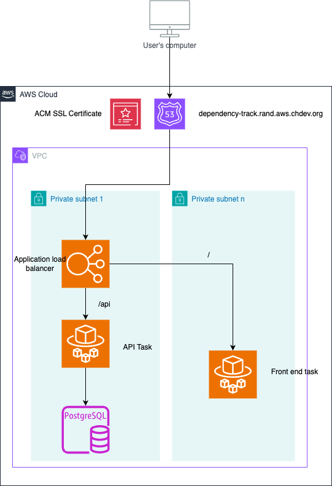

# dependency-track-aws-terraform

Creates deployment of [Dependency Track](https://dependencytrack.org/) to AWS.
The deployment is managed by Companies House Concourse.

## Overview

Dependency Track is an application developed by OWASP for keeping a track of
vulnerabilities within the applications we develop. It analyses SBOM files to
look through all dependencies and then highlights any that are insecure
allowing Service Owners to understand the security of their services and be
able to prioritise accordingly.

The deployment looks like the below (some things like Security Groups are
ommitted.)

The terraform is deployed using Companies House Concourse.

## SSO Configuration

SSO Is configured in both the API and Frontend via the environment variables.
This configuration is stored as secrets within the vault and read into the
applications via SSM Parameter Store.

<!-- TODO: Flesh out with full SSO configuration once known -->
